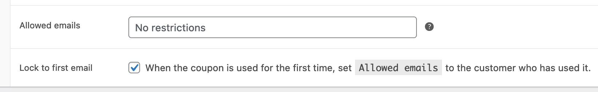

  

# Lock Coupon to Email

WooCommerce plugin to restrict a multi-use coupon the to the first customer who uses it.

Tested working with [Coupon Generator for WooCommerce](https://wordpress.org/plugins/coupon-generator-for-woocommerce/).